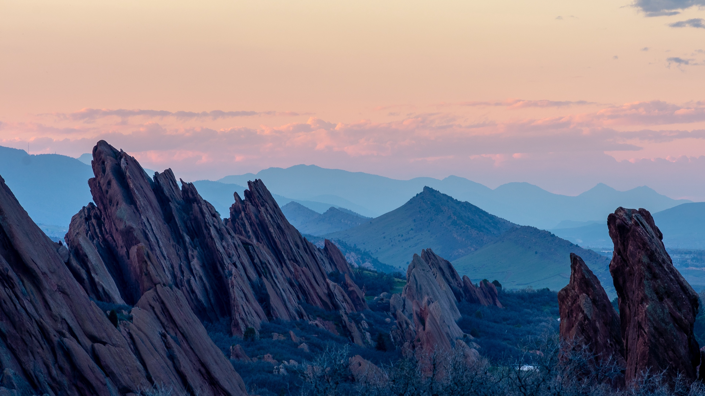
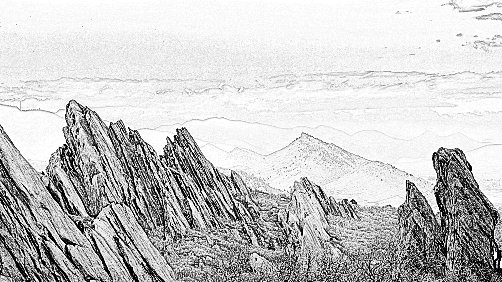
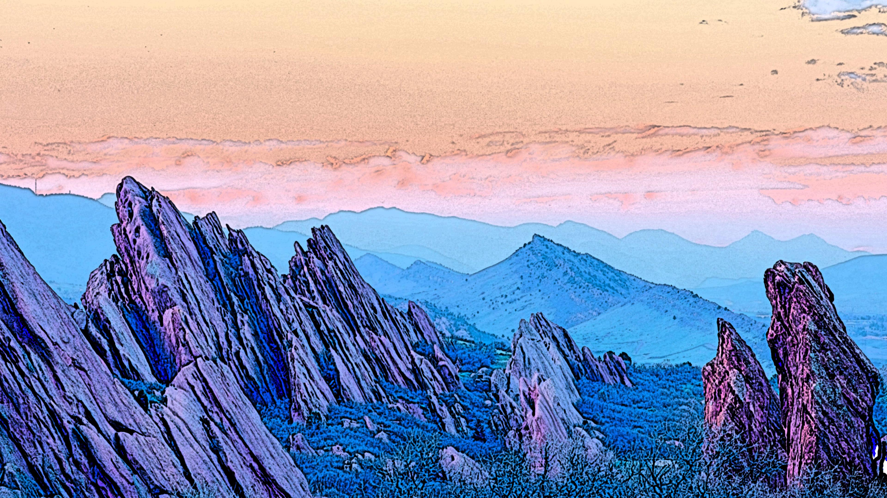
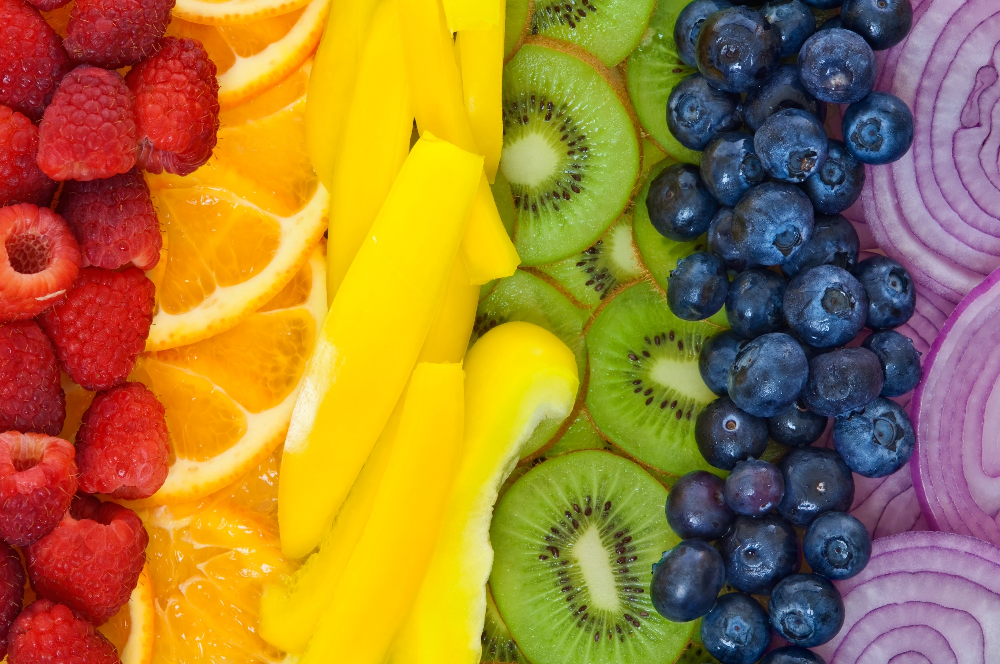
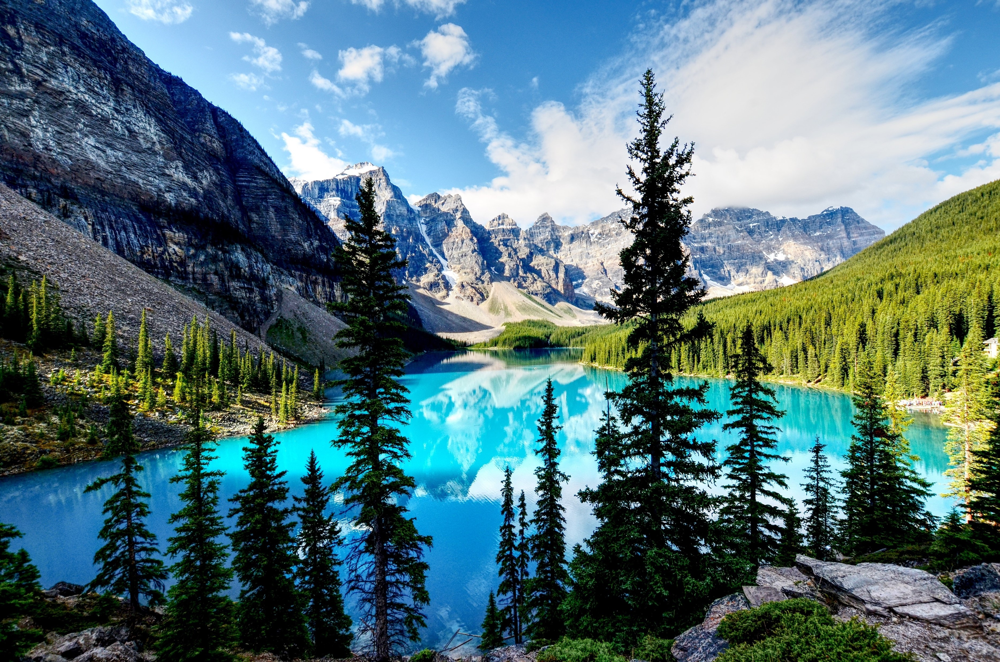
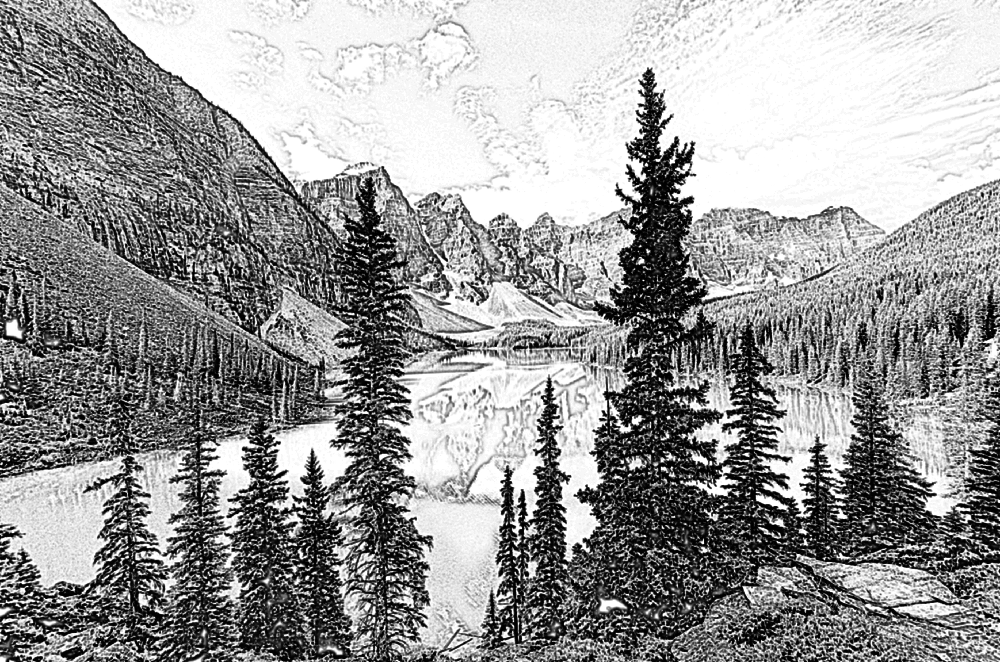
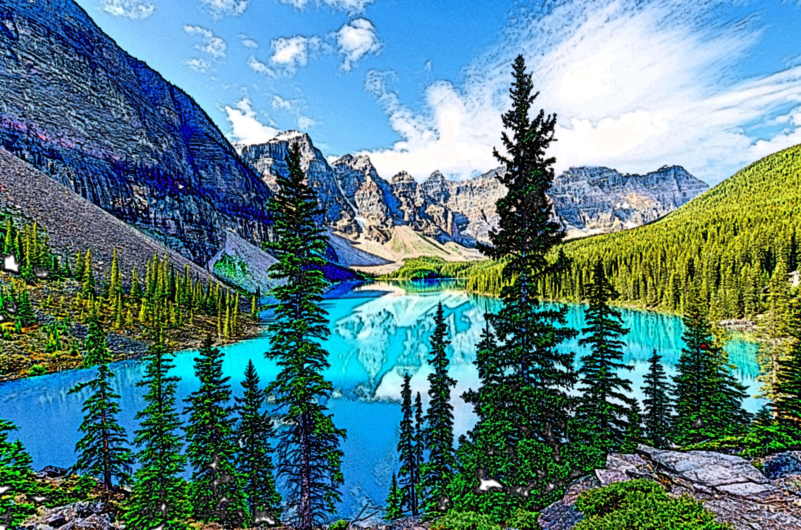
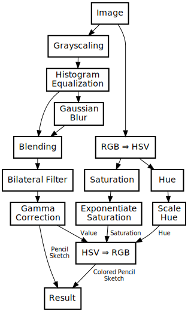

# Pencil

A Pencil Sketch generator.

Run `main.kt` and adjust parameters as desired.

## Gallery

## Pipeline

The Image Processing Pipeline used for the Pencil Sketching Algorithm is shown below.

## Pipeline Example

