# Pencil

A Pencil Sketch generator.

Run `main.kt` and adjust parameters as desired.

## Gallery

Original | Sketched | Colored
--- | --- | ---
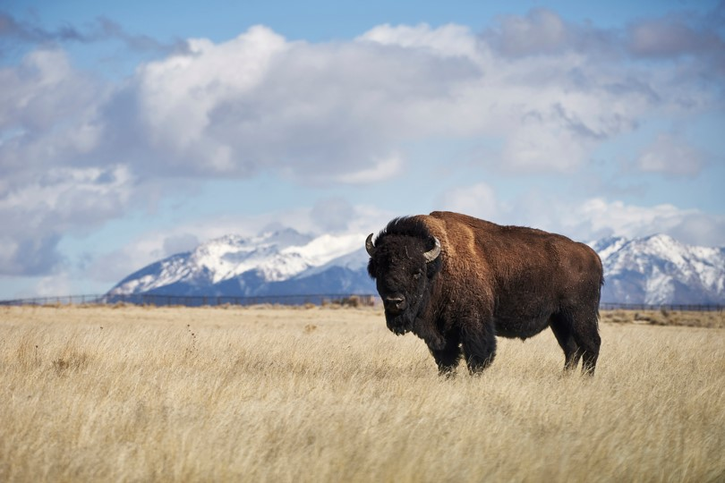 | 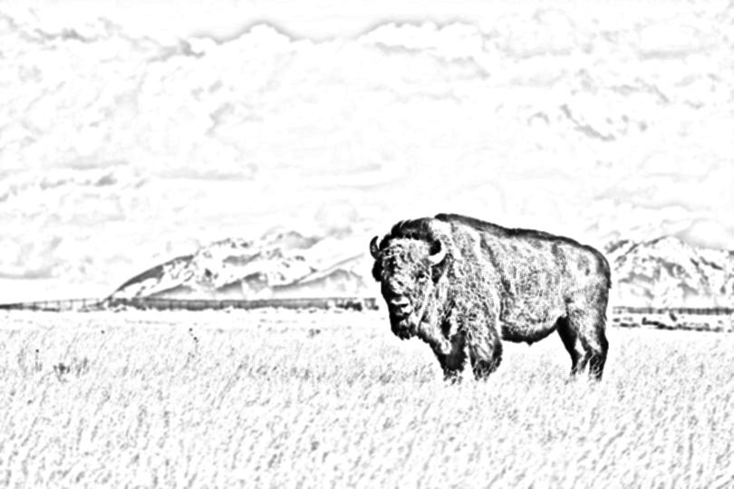 | 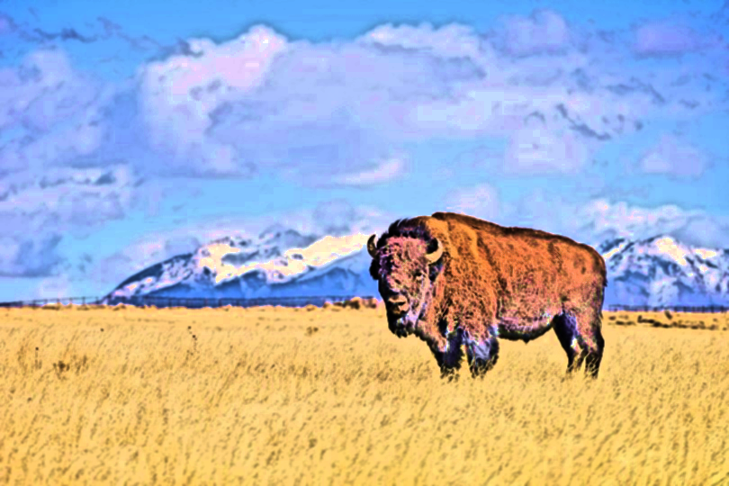
 | 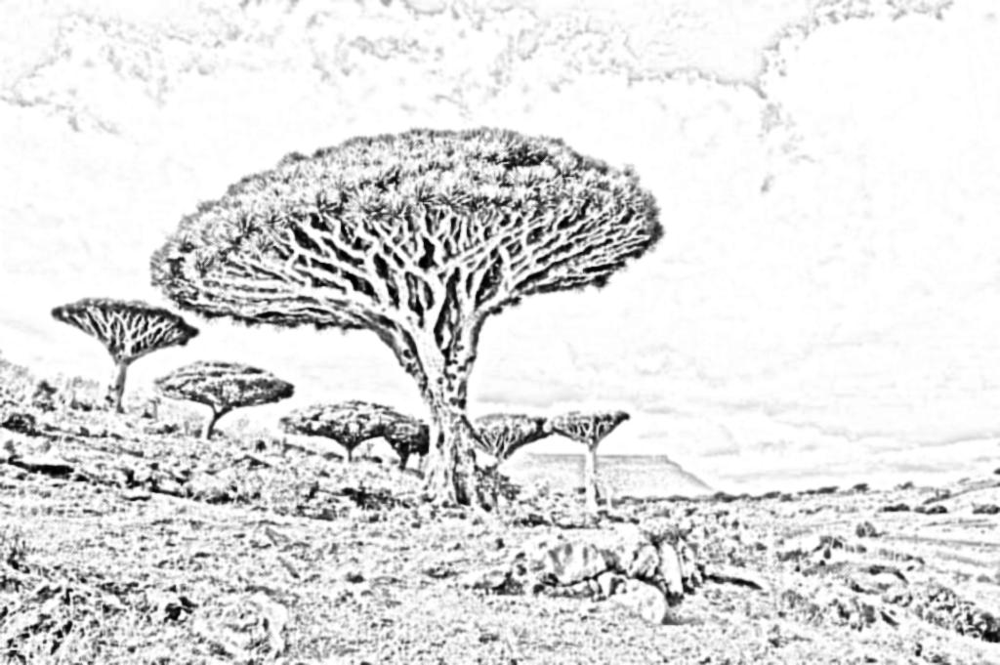 | 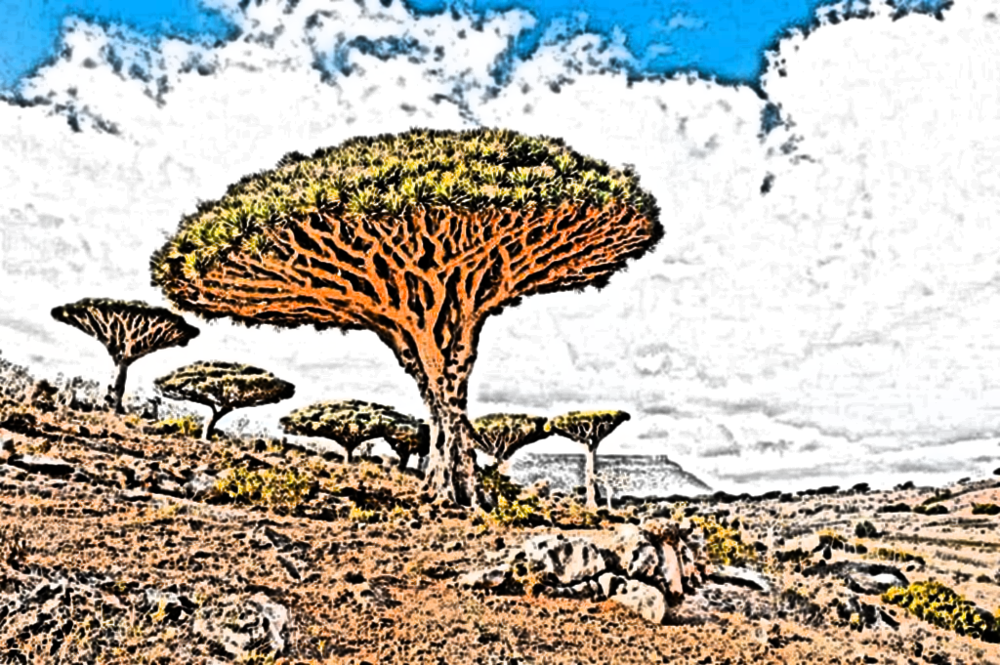
 | 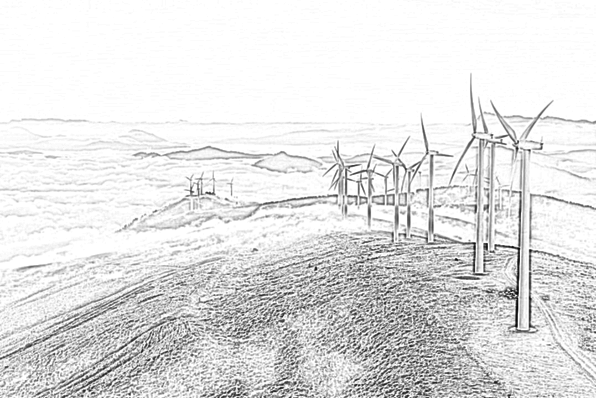 | 
 | 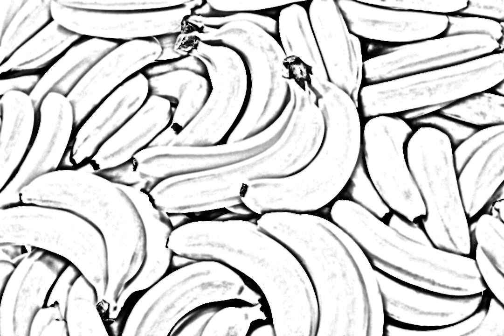 | 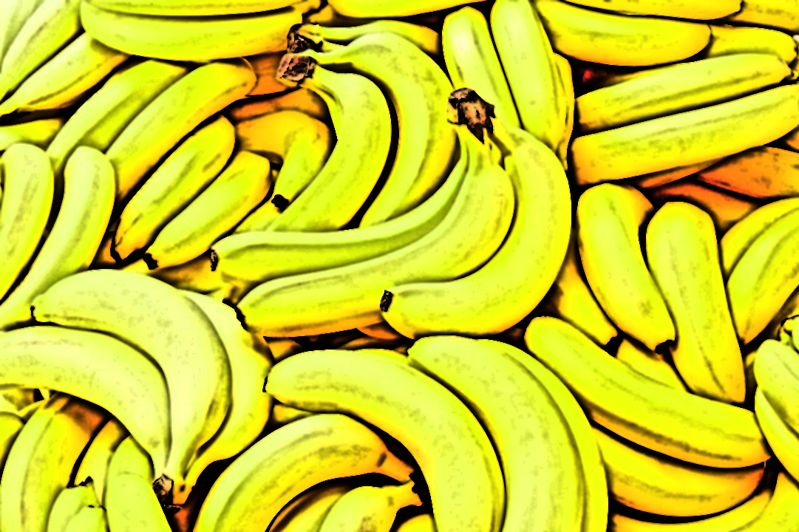
 |  | 
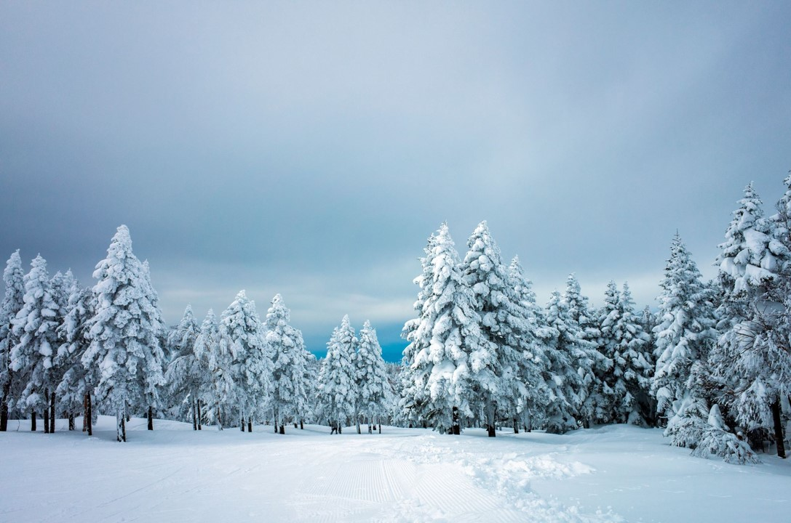 | 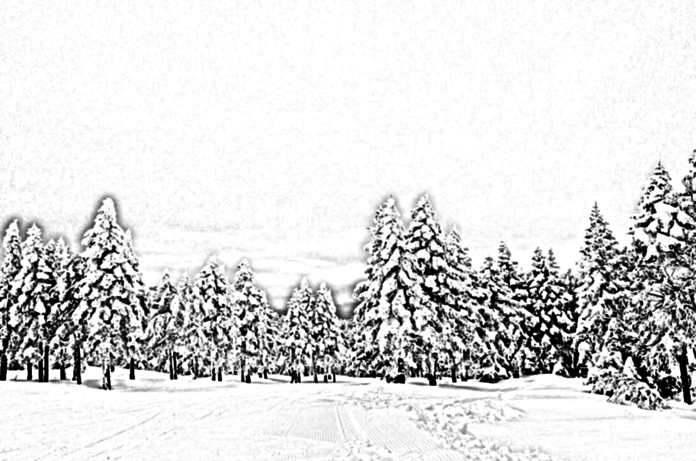 | 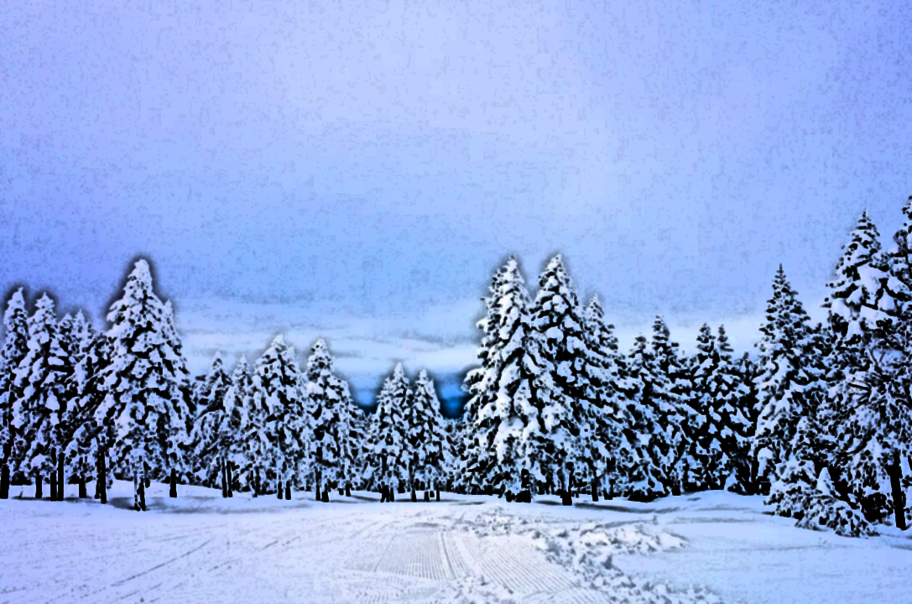
 | 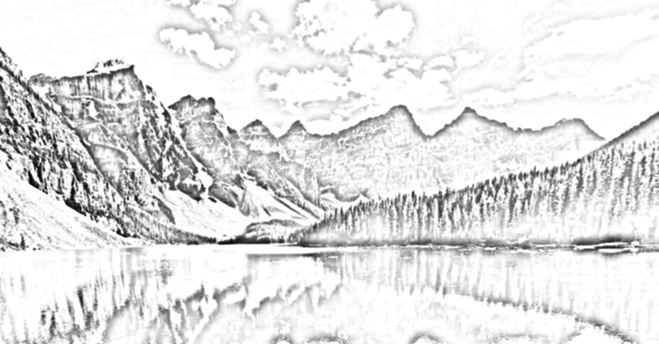 | 
 | 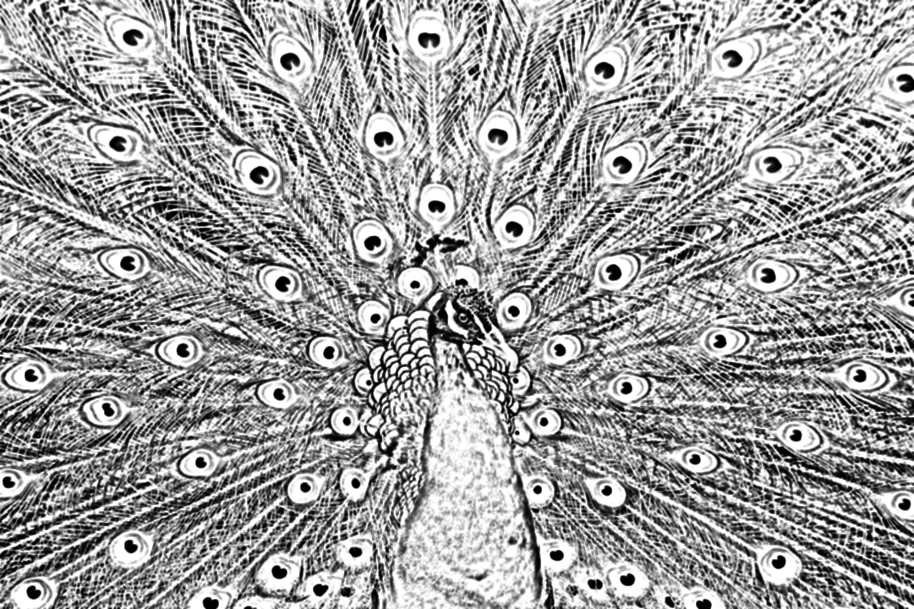 | 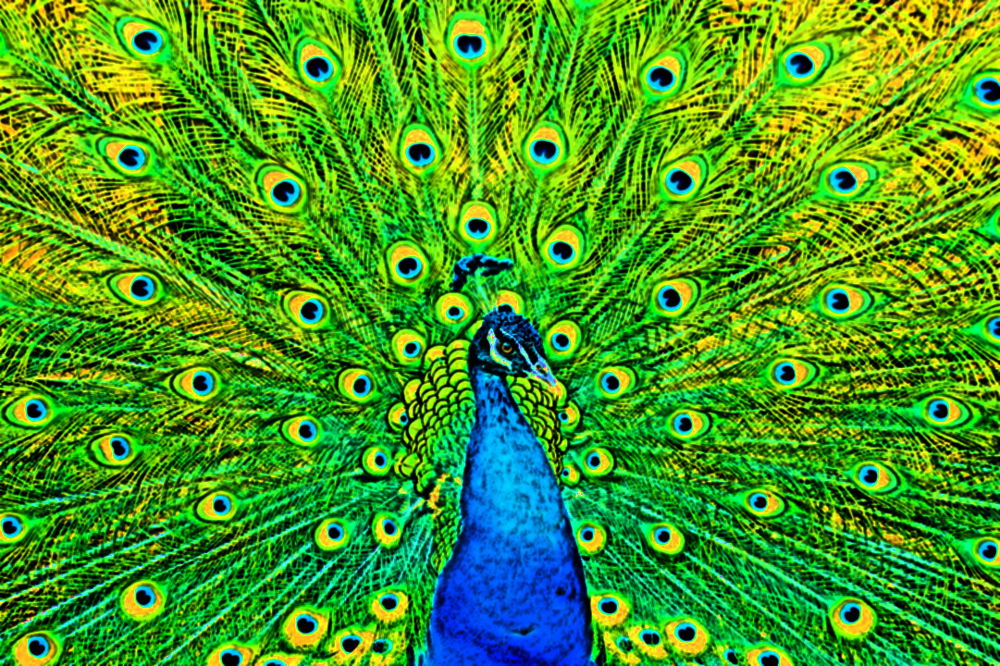
 | 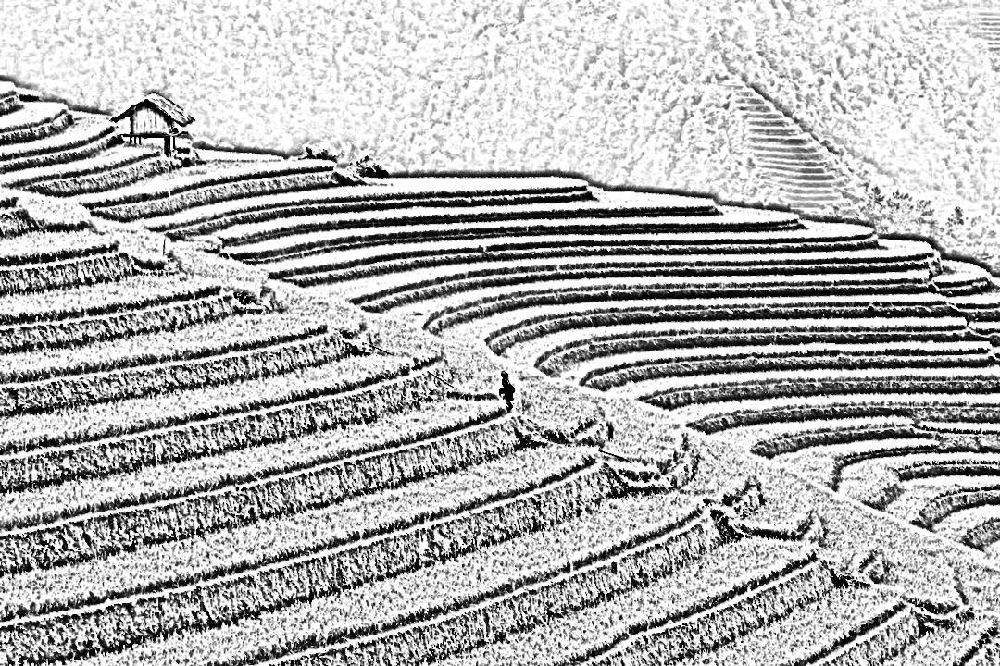 | 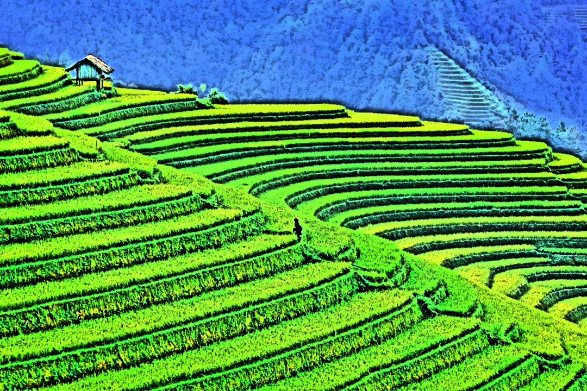

## Pipeline

The Image Processing Pipeline used for the Pencil Sketching Algorithm is shown below.

## Pipeline Example

